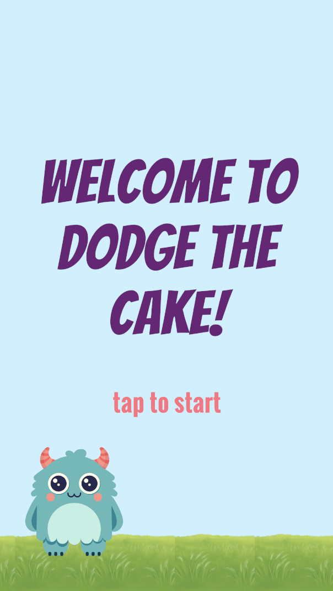
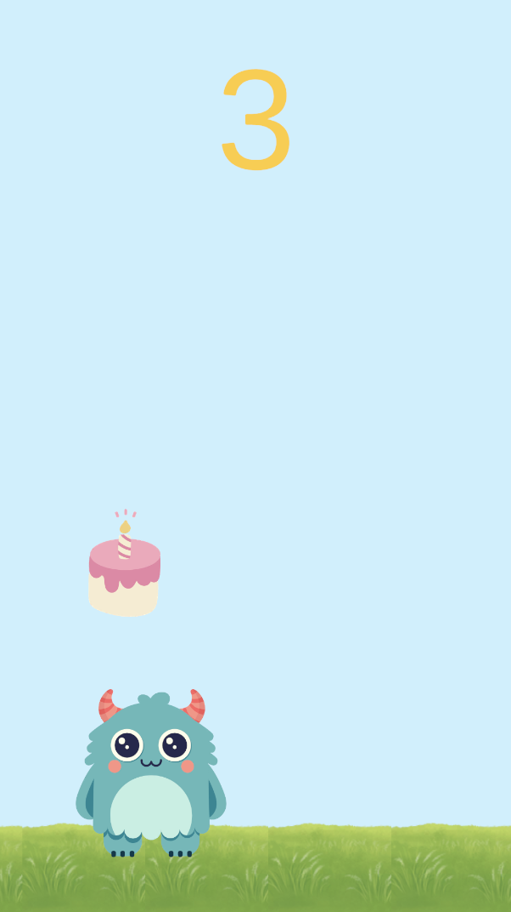
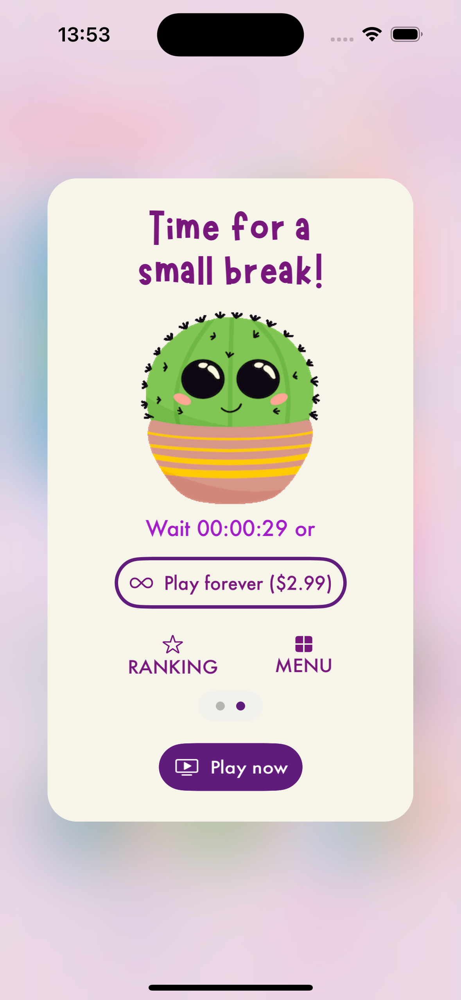

**Welcome to our cake coding challenge!**

In the project, you will find a simple game with falling cakes which the player has to avoid by moving the monster left and right.

Game Menu             |  Example Gameplay
:-------------------------:|:-------------------------:
 | 

**Submission details**

Please make a private repo by using this one as a template. Solve the challenge, create a PR in your copy and add [@itsbeatka](https://www.github.com/itsbeatka) to it when you're ready with your solution.

**Task overview**

We would like you to introduce a temprary limit to how long the user can play. We measure the length of a play session in the number of avoided cakes.

After a cooldown period, the player should be able to resume playing until hitting the limit again. 

In a real game, the player should be able to skip the limit by watching an ad. Please include a button for *"Instant refresh"* but there's no need to add any ad integration in this task.

**Detailed description**

- Allow the user to dodge 10 cakes
- The cooldown period is 60s
- After the 10th cake, pause the game and show a dialog with following elements:
  - a title saying *"You've reached your cake limit!"*
  - a countdown timer with a message *"Wait 00:01:00 to restore it"* below the title (the timer should be counting down from the full duration of the cooldown period to 0)
  - a button with a title *"Instant refresh"* that skips the wait instantly
- Upon reaching 0 on the timer or clicking on the *"Instant refresh"* button, the dialog should be dismissed and the user should be able to continue playing for another 10 cakes

There's no need to style the dialog in any particular way, you can use the default styles for the UI. 

If you want, you can use the following screen from Squarelets as an inspiration but there's **no need to style the UI** to match it.

Feel free to modify the existing project as you see fit.

If you have any questions reach out to careers@chaoscookie.games.

Good luck!
